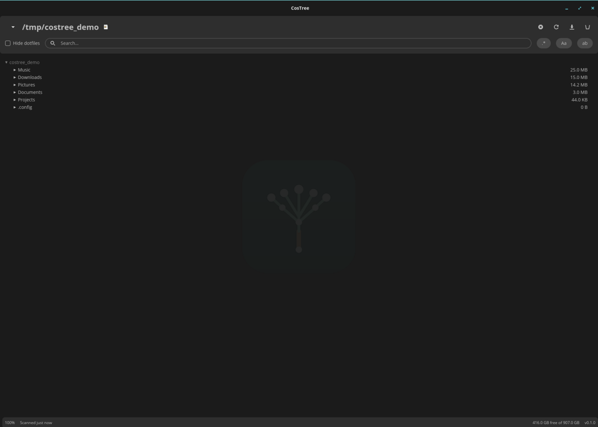

# CosTree


A graphical disk usage analyzer for the [COSMIC desktop](https://github.com/pop-os/cosmic-epoch), built with [libcosmic](https://github.com/pop-os/libcosmic) (the same Rust/iced-based toolkit used by System76's own COSMIC apps).

<br clear="left">



## Features

- **Incremental scanning** — the top level of a directory shows up instantly; each subdirectory's full size streams in as its background scan finishes, so you're never staring at a blank window while a huge tree is walked.
- **Live progress** — a status bar shows scan percentage, the directory currently being visited, and free/total space on the scan root's filesystem.
- **Cancel anytime** — stop an in-progress scan without losing whatever's already been found.
- **Save & reload scans** — save a completed scan to `.costree/` under the scanned directory (as a compact binary index, not JSON) and reopen it instantly next time instead of rescanning.
- **Search & filter** — filter the tree by name, with regex, case-sensitivity, and whole-word toggles, or hide dotfiles.
- **Scan anywhere** — jump to your home directory, the filesystem root, or any other mounted drive from a quick-pick dropdown, click the pencil icon to browse for a folder, or type/paste any path.
- **File operations** — right-click (or use the toolbar) to open a folder in COSMIC Files, open a file with its default app, rename, or delete — with a confirmation dialog before anything is permanently deleted.
- **Native COSMIC look** — theming (colors, light/dark) is pulled live from the system theme, no hardcoded colors.

## Installing

### From a `.deb` (Pop!_OS / other Debian-based distros)

Download the `.deb` from the [latest release](https://github.com/Jonesie/costree/releases/latest) and install it:

```bash
sudo dpkg -i costree_*.deb
```

This registers CosTree's icon and launcher entry so it shows up in the COSMIC app launcher — building from source with `cargo build`/`cargo run` does not.

### From source

Requires a recent Rust toolchain (edition 2021, needs Rust 1.85+ since `libcosmic` uses edition 2024 internally) and a few system dev packages for the Wayland/GPU rendering stack:

```bash
sudo apt-get install -y libxkbcommon-dev libwayland-dev libegl1-mesa-dev libxkbcommon-x11-dev
cargo build --release
```

The binary will be at `target/release/costree`.

## Usage

```bash
cargo run --release
```

CosTree scans your home directory on startup.

- **Changing the scan root** — click the pencil icon next to the title to either type/paste a path or open a folder-picker dialog, or use the quick-pick dropdown to jump straight to Home, the filesystem root, or another mounted drive.
- **Expanding/collapsing** — click the arrow next to a folder, or double-click anywhere on its row.
- **Keyboard shortcuts** — `F5` refreshes (rescans) the current root; `Delete` deletes the selected entry.
- **Right-click** an entry for a context menu: open in COSMIC Files (or open the file directly with its default app), rename, or delete.
- **Search** — the search box filters by name after a short debounce, auto-expanding any folder that contains a match (capped at 1000 results for very broad queries, so a single-character search on a huge tree doesn't try to render everything at once) and showing a "Searching…" indicator while it runs. Three toggle buttons next to it control how the query is matched:
  - `.*` — treat the query as a regular expression instead of a literal substring.
  - `Aa` — match case exactly (off by default).
  - `ab` — match whole words only.

  Click the **X** in the search box to clear it.
- **Hide dotfiles** — the checkbox in the toolbar; this preference is remembered between runs.
- **Save index** — once a scan finishes, click the save icon to write it to `.costree/` under the scanned directory. Next time you scan that same root, CosTree loads the saved index instantly instead of rescanning from disk.

## Performance

Directory scanning parallelizes across every core via [rayon](https://github.com/rayon-rs/rayon) — the whole tree is walked concurrently at every level, not just across top-level branches, so scan speed scales with the machine rather than with how many top-level directories the scan root happens to have.

A [criterion](https://github.com/bheisler/criterion.rs) benchmark (`benches/scan_benchmark.rs`) exercises the scanner against a synthetic directory tree. Run it locally with:

```bash
cargo bench
```

CI runs the same benchmark on every push to `main` and tracks results over time — see the [benchmark history dashboard](https://jonesie.github.io/costree/dev/bench/).

## Author

Peter G. Jones (New Zealand)

If CosTree is useful to you, you can support ongoing development by buying me a coffee:

<a href="https://buymeacoffee.com/jonesie"></a>

## License

MIT — see [LICENSE](LICENSE).
